# ENTREGA ÚNICA — Reto 03 (UT3)

## 1) Portada

- **Módulo:** Fundamentos de Hardware (FHW)  
- **Unidad:** UT3  
- **Reto:** 03 — PC de oficina low-cost + Mini PC  
- **Alumno/a:** Ugo Pérez Ruiz  
- **Curso/Grupo:** 1º ASIR  
- **Fecha:** 17/2/2025  
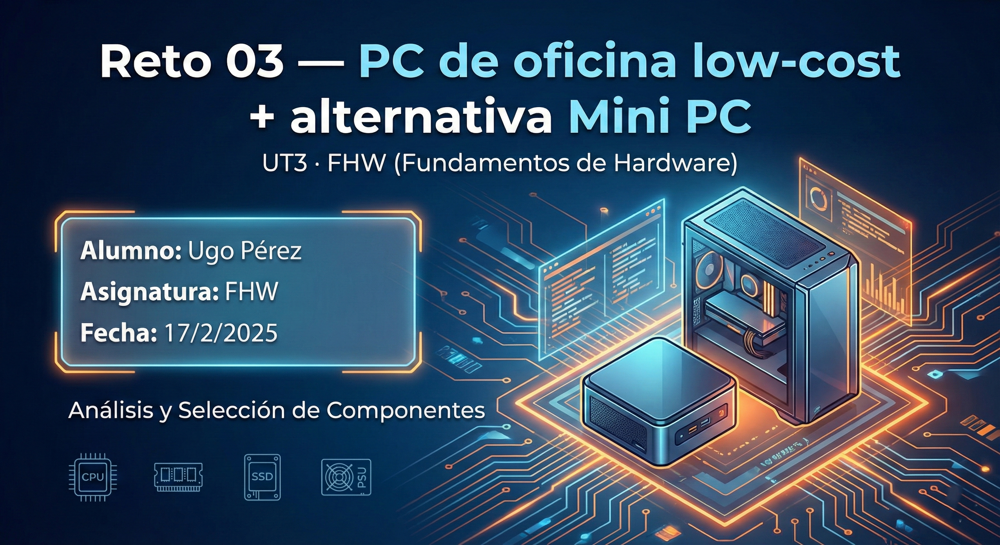

## 2) Opción A — PC por piezas (PASO 1–7)
# Opción A — PC de oficina por piezas (PASO 1–8)

## PASO 1 — [CPU]

**Componente elegido: CPU**  
- **Marca y modelo: AMD Ryzen 5 5600GT**  
- **Precio (€): 139,90€**  
- **URL tienda: https://www.pccomponentes.com/amd-ryzen-5-5600gt-36-46ghz-box?offer=7540e2b2-3bce-4923-87a3-8b7a86f23607**  

**Ficha técnica oficial (obligatorio):**  
- URL oficial (fabricante/estándar): https://www.amd.com/es/support/downloads/drivers.html/processors/ryzen/ryzen-5000-series/amd-ryzen-5-5600gt.html#amd_support_product_spec  

**Características principales (resumen):**
- 6 núcleos / 12 hilos.

- Frecuencia: 3.6 GHz (Base) - 4.6 GHz (Turbo).

- Gráficos integrados: Radeon™ Graphics (7 núcleos a 1900 MHz).

- TDP: 65W.

**Justificación (oficina):**
- Posee 6 núcleos físicos, lo que garantiza fluidez extrema en multitarea profesional (navegador con muchas pestañas, Excel pesado y videollamadas simultáneas). 

- Sus gráficos integrados permiten prescindir de una GPU dedicada.

**Compatibilidad (obligatorio, con enlaces):**
- Socket soportado: AM4.

- Evidencia (URL): https://www.amd.com/es/support/downloads/drivers.html/processors/ryzen/ryzen-5000-series/amd-ryzen-5-5600gt.html#amd_support_product_spec   

- 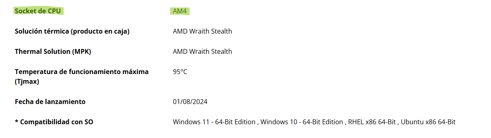

- Tipo de memoria: DDR4 hasta 3200 MT/s.

- Evidencia (URL): https://www.amd.com/es/support/downloads/drivers.html/processors/ryzen/ryzen-5000-series/amd-ryzen-5-5600gt.html#amd_support_product_spec 

- 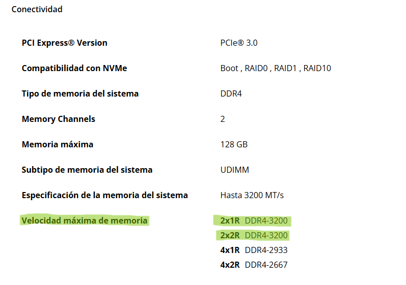

-----------------------------------------------------------------------------------------------------------------------------------------------------------------------------------

## PASO 2 — [Placa_Base]

**Componente elegido: Placa Base**  
- **Marca y modelo: MSI B550M PRO-VDH**  
- **Precio (€): 87,89€**  
- **URL tienda: https://www.pccomponentes.com/msi-b550m-pro-vdh?offer=260db0dd-0dd1-48e9-8ced-760e18aa635f**  

**Ficha técnica oficial (obligatorio):**  
- URL oficial (fabricante/estándar): https://es.msi.com/Motherboard/B550M-PRO-VDH   

**Características principales (resumen):**
- Chipset: AMD B550.

- Formato: Micro-ATX (24.4 cm x 24.4 cm).

- Ranuras de memoria: 4x DDR4 (hasta 128GB).

- Salidas de vídeo: 1x HDMI 2.1, 1x DisplayPort, 1x VGA.

- Almacenamiento: 2x slots M.2 y 4x puertos SATA 6Gb/s.

**Justificación (oficina):**
- Esta placa de la serie PRO de MSI está diseñada para flujos de trabajo profesionales. 
- Su principal ventaja para oficina es la triple salida de vídeo (HDMI, DP y VGA), lo que garantiza compatibilidad con cualquier monitor existente sin necesidad de adaptadores.
- Además, el chipset B550 ofrece una base sólida y duradera.

**Compatibilidad (obligatorio, con enlaces):**
- CPU/Placa (Socket AM4): Soporta procesadores AMD Ryzen de la serie 5000 (como el 5600GT seleccionado).

- Evidencia (URL): https://es.msi.com/Motherboard/B550M-PRO-VDH/support#cpu

- 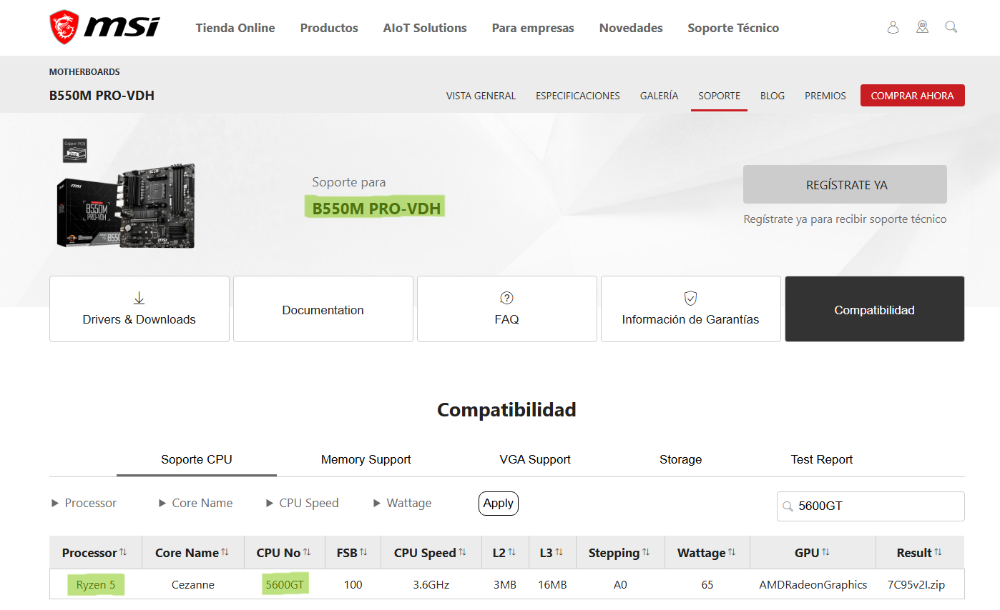

- RAM/Placa (Tipo DDR4): Dispone de 4 ranuras DIMM compatibles con memoria DDR4 Dual Channel.

- Evidencia (URL): https://es.msi.com/Motherboard/B550M-PRO-VDH/Specification (Ver sección "DETALLADAS").

- 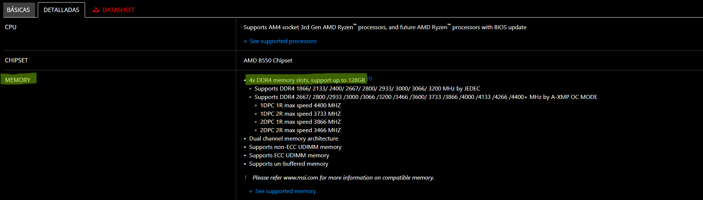

-----------------------------------------------------------------------------------------------------------------------------------------------------------------------------------

## PASO 3 — [Memoria_RAM]

**Componente elegido: Memoria RAM**  
- **Marca y modelo: Kingston FURY Beast DDR4 3200 MHz 16GB 2x8GB CL16**  
- **Precio (€): 164,95€**  
- **URL tienda: https://www.pccomponentes.com/kingston-fury-beast-ddr4-3200-mhz-16gb-2x8gb-cl16?offer=0ea6d28c-dde0-4666-8c6c-9471111fc2d0**  

**Ficha técnica oficial (obligatorio):**  
- URL oficial (fabricante/estándar): https://www.kingston.com/es   

**Características principales (resumen):**
- Capacidad: 16 GB (Kit 2x8GB).

- Velocidad: 3200 MHz.

- Latencia: CL16.

**Justificación (oficina):**
- Disponer de 16 GB en configuración de doble canal garantiza que el sistema operativo y las aplicaciones de oficina (como navegadores con muchas pestañas o bases de datos) funcionen sin ralentizaciones. 

- Al ser una memoria de baja latencia (CL16), mejora el tiempo de respuesta general del procesador Ryzen.
**Compatibilidad (obligatorio, con enlaces):**
- Tipo de memoria (DDR4): El kit utiliza el estándar DDR4, que es el formato que requiere la placa base MSI seleccionada.

- Evidencia (URL): https://www.kingston.com/datasheets/KF432C16BBK2_16.pdf 

- 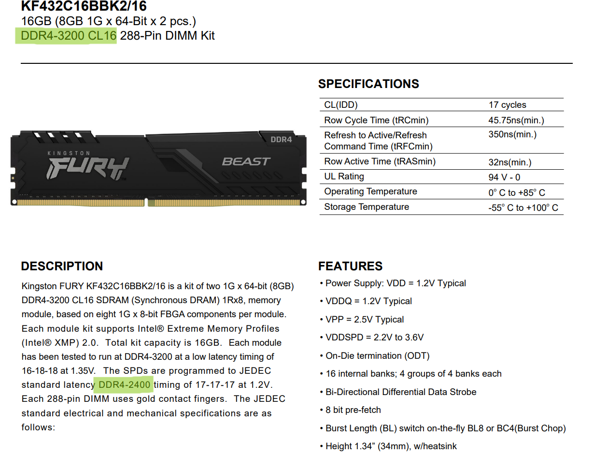

- Velocidad y Perfiles (XMP): El kit incluye perfiles XMP 2.0 que permiten a la CPU Ryzen 5 reconocer automáticamente la velocidad de 3200 MHz.

- Evidencia (URL): https://www.kingston.com/datasheets/KF432C16BBK2_16.pdf 

- 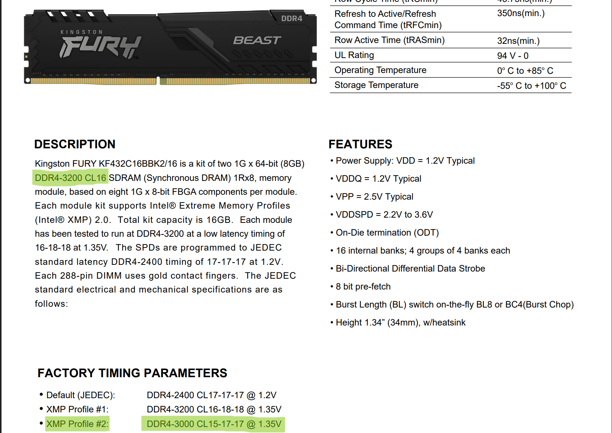

-----------------------------------------------------------------------------------------------------------------------------------------------------------------------------------

## PASO 4 — [Almacenamiento]

**Componente elegido: Almacenamiento SSD**  
- **Marca y modelo: WD Green SN350 SSD 250GB M.2 NVMe**  
- **Precio (€): 76,99€**  
- **URL tienda: https://www.pccomponentes.com/disco-duro-wd-green-sn350-ssd-250gb-m2-nvme?offer=6587234b-4ccb-4ffa-bb98-cdfb87564702**  

**Ficha técnica oficial (obligatorio):**  
- URL oficial (fabricante/estándar): https://support-es.sandisk.com/app/products/product-detailweb/p/2292   

**Características principales (resumen):**
- Formato: M.2 2280.

- Interfaz: NVMe™ PCIe® Gen3 x4.

- Rendimiento: Velocidades de lectura secuencial de hasta 2400 MB/s.

- Resistencia: Alta resistencia a impactos y vibraciones al no tener partes móviles.

**Justificación (oficina):**
- La tecnología NVMe es esencial en un entorno de oficina moderno para reducir drásticamente los tiempos de espera. 

- El sistema operativo arranca en pocos segundos y las aplicaciones pesadas de gestión cargan de forma casi instantánea, mejorando la productividad diaria. 

**Compatibilidad (obligatorio, con enlaces):**
- SSD/Placa (Slot físico): La placa MSI B550M PRO-VDH dispone de dos ranuras M.2 compatibles con el formato 2280 de este disco.

- Evidencia (URL): https://es.msi.com/Motherboard/B550M-PRO-VDH/Specification

- 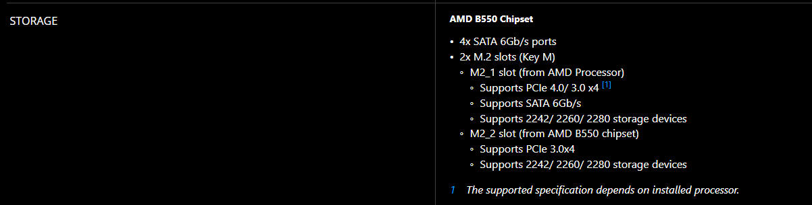

- SSD/Placa (Protocolo): El disco utiliza la interfaz PCIe Gen3, la cual es soportada nativamente por el chipset B550 de la placa base.

- Evidencia (URL): https://es.msi.com/Motherboard/B550M-PRO-VDH/Specification y https://products.wdc.com/library/SpecSheet/ESN/02-01-WW-04-00079.pdf  

- 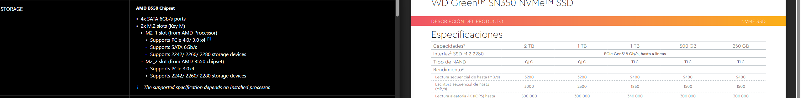

-----------------------------------------------------------------------------------------------------------------------------------------------------------------------------------

## PASO 5 — [Fuente_de_Alimentación]

**Componente elegido: Fuente de Alimentación**  
- **Marca y modelo: Gigabyte 650W 80 PLUS Gold P650G**  
- **Precio (€): 67,55€**  
- **URL tienda: https://www.pccomponentes.com/fuente-alimentacion-fuente-de-alimentacion-gigabyte-650w-80-plus-gold-modelo-p650g-enfriamiento-activo?offer=8156308a-89bf-4315-a83b-799ea6adc590**  

**Ficha técnica oficial (obligatorio):**  
- URL oficial (fabricante/estándar): https://www.gigabyte.com/Power-Supply/GP-P650G   

**Características principales (resumen):**
- Potencia: 650W.

- Certificación: 80 PLUS Gold (Eficiencia energética superior al 90%).

- Ventilador: 120mm con rodamiento hidráulico (silencioso).

- Protecciones: OVP, OPP, SCP, UVP, OCP, OTP.

**Justificación (oficina):**
- La certificación Gold garantiza que la fuente genera menos calor y desperdicia menos energía, lo que se traduce en un PC más silencioso y un ahorro en la factura eléctrica de la oficina a largo plazo.

**Compatibilidad (obligatorio, con enlaces):**
- PSU/Placa (Conectores): Incluye el conector ATX de 24 pines y el EPS de 8 pines (4+4) requeridos por la placa MSI B550M.

- Evidencia (URL): https://www.gigabyte.com/Power-Supply/GP-P650G/sp

- 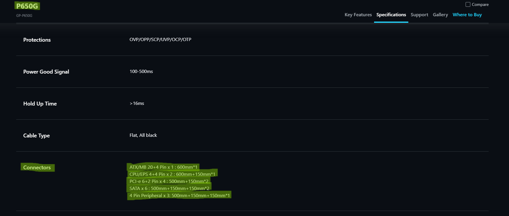

- PSU/Caja (Formato): Cumple con el estándar ATX, compatible con el chasis Hiditec seleccionado.

- Evidencia (URL): https://www.gigabyte.com/Power-Supply/GP-P650G/sp 

- 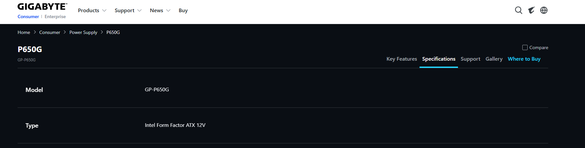

-----------------------------------------------------------------------------------------------------------------------------------------------------------------------------------

## PASO 6 — [Chasis]

**Componente elegido: Caja/Torre**  
- **Marca y modelo: Hiditec Klyp USB 3.0 Negra**  
- **Precio (€): 27,95€**  
- **URL tienda: https://www.pccomponentes.com/hiditec-klyp-usb-30-negra?offer=5e5d8d52-a922-44be-a9c4-923527e9e76a**  

**Ficha técnica oficial (obligatorio):**  
- URL oficial (fabricante/estándar): https://hiditec.com/es/mid-tower/11-klyp.html   

**Características principales (resumen):**
- Formato: Micro ATX / ITX.

- Conectores frontales: 1 x USB 3.0, 2 x USB 2.0, Audio HD.

- Dimensiones: 365 x 178 x 355 mm.

**Justificación (oficina):**
- Es un chasis sobrio y compacto que ocupa poco espacio en el escritorio. 

- Incluye puerto USB 3.0 frontal para transferencias rápidas de archivos sin necesidad de acceder a la parte trasera.

**Compatibilidad (obligatorio, con enlaces):**
- Caja/Placa (Factor de forma): Soporta placas Micro ATX, coincidiendo con el formato de nuestra placa MSI.

- Evidencia (URL): https://hiditec.com/es/mid-tower/11-klyp.html (Ver detalles del producto)

- 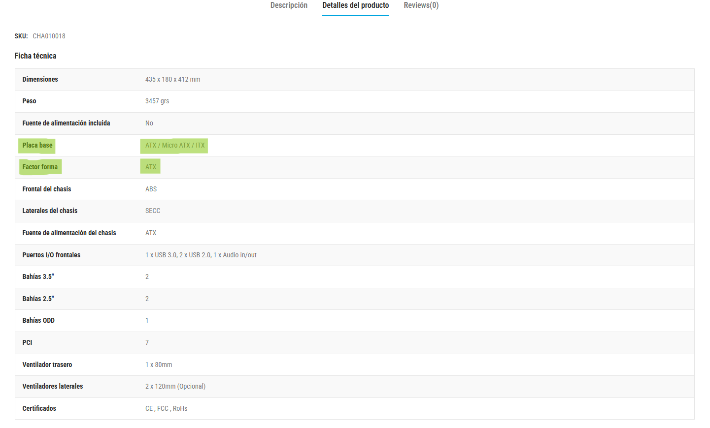

- Caja/PSU: Admite fuentes de alimentación formato ATX estándar.

- Evidencia (URL): https://hiditec.com/es/mid-tower/11-klyp.html (Ver detalles del producto)

- 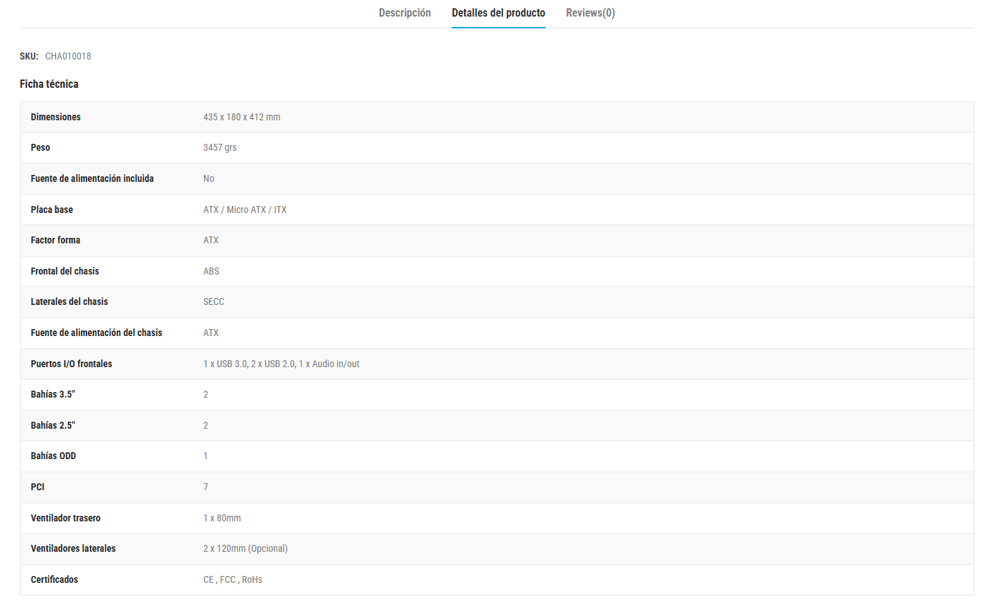

-----------------------------------------------------------------------------------------------------------------------------------------------------------------------------------

## PASO 7 — [Disipador_CPU]

**Componente elegido: Refrigeración CPU**  
- **Marca y modelo: Nox HUMMER H-400**  
- **Precio (€): 35,90€**  
- **URL tienda: https://www.pccomponentes.com/ventilador-cpu-nox-hummer-h-400-ventilador-cpu-120mm-negro?offer=3ab43cd7-d37e-4d59-a011-057f943a1d78**  

**Ficha técnica oficial (obligatorio):**  
- URL oficial (fabricante/estándar): https://www.nox-xtreme.com/refrigeracion/h-400   

**Características principales (resumen):**
- Ventilador de 120 mm con control PWM.

4 heatpipes de cobre de contacto directo.

Base de aluminio.

Nivel de ruido: 18.0 ~ 30.0 dBA.

**Justificación (oficina):**
- Proporciona una refrigeración muy superior al disipador de serie de AMD, lo que permite que el procesador trabaje a temperaturas más bajas. 

- Al ser más eficiente, el ventilador gira a menos revoluciones, manteniendo el PC silencioso en entornos de oficina.

**Compatibilidad (obligatorio, con enlaces):**
- Disipador/CPU (Socket): Es compatible con el socket AM4 del Ryzen 5 5600GT.

- Evidencia (URL): https://www.nox-xtreme.com/refrigeracion/h-400 (Ver compatibilidad del producto)

- 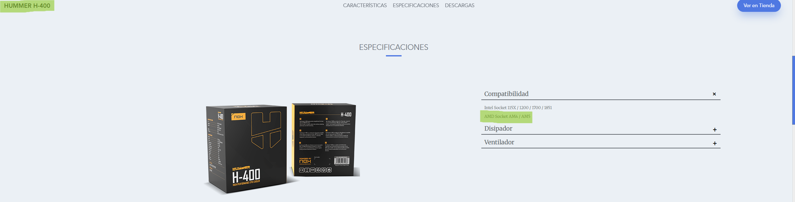

- Disipador/Caja (Altura): Tiene una altura de 155 mm, compatible con el ancho del chasis Hiditec Klyp.

- Evidencia (URL): https://hiditec.com/es/mid-tower/11-klyp.html (Ver sección "disipador" del producto)

- 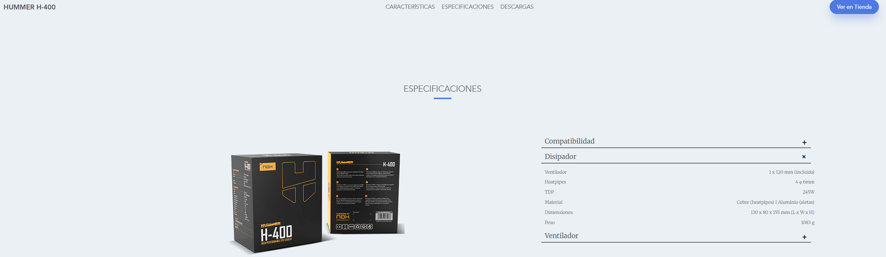

-----------------------------------------------------------------------------------------------------------------------------------------------------------------------------------

## PASO 8 — [Presupuesto_Final]

| Componente |             Modelo                |  Precio (€) | URL tienda |

| CPU        | AMD Ryzen 5 5600GT                |    139,90€  | https://www.pccomponentes.com/amd-ryzen-5-5600gt-36-46ghz-box?offer=7540e2b2-3bce-4923-87a3-8b7a86f23607 |
| Placa base | MSI B550M PRO-VDH                 |    87,89€   | https://www.pccomponentes.com/msi-b550m-pro-vdh?offer=260db0dd-0dd1-48e9-8ced-760e18aa635f |
| RAM        | Kingston FURY Beast 16GB (2x8GB)  |    164,95€  | https://www.pccomponentes.com/kingston-fury-beast-ddr4-3200-mhz-16gb-2x8gb-cl16?offer=0ea6d28c-dde0-4666-8c6c-9471111fc2d0 |
| SSD        | WD Green SN350 SSD 250GB          |    76,99€   | https://www.pccomponentes.com/disco-duro-wd-green-sn350-ssd-250gb-m2-nvme?offer=6587234b-4ccb-4ffa-bb98-cdfb87564702 |
| PSU        | Gigabyte 650W 80 PLUS Gold        |    67,55€   | https://www.pccomponentes.com/fuente-alimentacion-fuente-de-alimentacion-gigabyte-650w-80-plus-gold-modelo-p650g-enfriamiento-activo?offer=8156308a-89bf-4315-a83b-799ea6adc590 |
| Chasis     | Hiditec Klyp USB 3.0              |    27,95€   | https://www.pccomponentes.com/hiditec-klyp-usb-30-negra?offer=5e5d8d52-a922-44be-a9c4-923527e9e76a |
| Disipador  | Nox HUMMER H-400                  |    35,90€   | https://www.pccomponentes.com/ventilador-cpu-nox-hummer-h-400-ventilador-cpu-120mm-negro?offer=3ab43cd7-d37e-4d59-a011-057f943a1d78 |
| **TOTAL**  |                                   |  **601,13€** | https://www.pccomponentes.com/configurador/48501f762 |

## 3) Opción B — Mini PC (PASO 8)
# Opción B — Mini PC ya montado (PASO 8)

**Producto elegido: Mini PC ya montado**  
- **Marca y modelo exacto: Beelink EQR6 (AMD Ryzen 7 6800U)**  
- **Precio (€): 539,99 €**  
- **URL tienda: https://www.pccomponentes.com/mini-pc-beelink-eqr6-amd-ryzen-7-6800u-24gb-500gb-ssd-radeon-680m-windows-11-pro-wi-fi-6e**  

**Ficha técnica oficial (obligatorio):**  
- URL oficial del fabricante: https://www.bee-link.com/es/products/beelink-eqr6?variant=47617891434738

**Especificaciones:**
- CPU: AMD Ryzen 7 6800U (8 núcleos / 16 hilos).

- RAM: 24 GB DDR5.

- SSD/almacenamiento: 500 GB NVMe SSD.

- Conectividad: Wi-Fi 6, Bluetooth, doble Ethernet, USB 3.2 y salida de vídeo Radeon 680M.

- Tamaño / consumo: Formato ultra compacto (126 x 126 x 45 mm) con un TDP de bajo consumo (15W-28W).

**Ventajas (mínimo 4):**
- Ahorro económico: Cuesta unos 61 € menos que el PC configurado por piezas.

- Memoria superior: Incluye 24 GB de RAM frente a los 16 GB de la opción A.

- Almacenamiento: El doble de capacidad (500 GB) que el disco seleccionado manualmente.

- Portabilidad: Su tamaño permite anclarlo detrás del monitor (soporte VESA), dejando el escritorio libre.

- Potencia de cálculo: Supera en núcleos (8 vs 6) al procesador del montaje por piezas.

- Tecnología de memoria: Utiliza RAM DDR5, mucho más rápida y eficiente que la DDR4 tradicional.

- Espacio y orden: Al integrar la fuente dentro del chasis, ahorra mucho espacio en el escritorio de la oficina.

- Licencia incluida: Ya viene con Windows 11 Pro preinstalado y configurado.

**Contras (mínimo 4):**
- Refrigeración: Al ser tan pequeño, el ventilador es más ruidoso bajo carga que el Nox Hummer.

- Gráficos: No permite instalar una tarjeta gráfica dedicada en el futuro.

- Procesador no actualizable: A diferencia del PC por piezas donde podrías cambiar la CPU en un futuro gracias al socket AM4, en este Mini PC el procesador Ryzen 7 6800U va    soldado a la placa base y no se puede mejorar nunca.

- Reparabilidad: Si falla un componente de la placa base, es casi imposible de reparar fuera de garantía.

**¿Para qué oficina SÍ / para qué NO?**
- Sí: Oficinas de contabilidad o gestión con espacios reducidos donde se necesite mucha multitarea.

- No: Puestos de diseño gráfico pesado o edición de vídeo que requieran potencia gráfica dedicada.

**Compatibilidad/ampliación (con enlaces):**
- ¿Se puede ampliar RAM?: Sí, admite hasta 64 GB mediante dos slots SODIMM DDR5.

- Evidencia: https://www.bee-link.com/es/products/beelink-eqr6?variant=47617891434738 (En página principal, scroll hacia abajo)

- 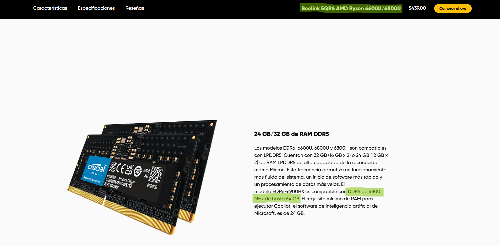

- ¿Se puede ampliar SSD?: Sí, dispone de dos ranuras M.2 2280 PCIe 4.0.

- Evidencia: https://www.bee-link.com/es/products/beelink-eqr6?variant=47617891434738 (En página principal, scroll hacia abajo)

- 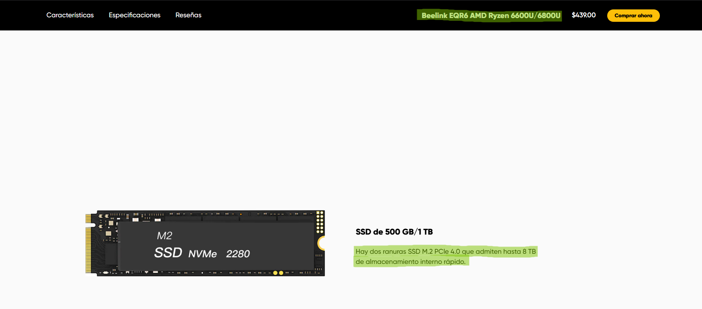

## Comparación rápida A vs B
Rellena esta tabla:

|   Aspecto                      | Opción A (por piezas)                                                  | Opción B (Mini PC)                                                 |

| Precio total                   |       601,13€                                                          |      539,99€                                                       |
| Rendimiento esperado (oficina) | Excelente respuesta en flujos de trabajo administrativos y multitarea. | Rendimiento superior en procesos paralelos (8 núcleos / 16 hilos). |
| Ampliación (RAM/SSD)           | Escalabilidad total mediante componentes estándar e intercambiables.   | Escalabilidad funcional limitada a memoria volátil y almacenamiento masivo. |
| Consumo/ruido/espacio          | Factor de forma torre con gestión térmica optimizada (Nox Hummer).     | Mínimo "footprint" y alta eficiencia energética con PSU integrada. |
| Facilidad de despliegue        | Baja (Requiere ensamblaje, testeo y configuración de SO manual).       | Inmediata (Solución "Plug & Play" con Windows 11 Pro preinstalado).|
| Garantía/soporte               | Gestión individual de garantías por fabricante de componente.          | Soporte técnico integral unificado para todo el sistema.           |

## 4) Checklist de compatibilidad
# Checklist de compatibilidad (OBLIGATORIO)

Piensa en esto como un **“enchufe y llaves”**:
- El **socket** es la “cerradura” de la placa base.
- La **CPU** es la “llave”.
Si no coincide, no entra.

Rellena con ✅ + enlaces de evidencia.

## Opción A (por piezas)

| Compatibilidad                                     | Evidencia (enlace)                                         | OK |

| CPU ↔ Placa base (socket/chipset soportado)        | https://es.msi.com/Motherboard/B550M-PRO-VDH/support#cpu   | ✅ |
| RAM ↔ Placa base (DDR4/DDR5, velocidad soportada)  | https://es.msi.com/Motherboard/B550M-PRO-VDH/Specification | ✅ |
| SSD ↔ Placa base (SATA o M.2; NVMe vs SATA)        | https://es.msi.com/Motherboard/B550M-PRO-VDH/Specification | ✅ |
| PSU ↔ Placa base (24-pin ATX, EPS 8-pin si aplica) | https://www.gigabyte.com/Power-Supply/GP-P650G/sp          | ✅ |
| Chasis ↔ Placa base (ATX/mATX/ITX)                 | https://hiditec.com/es/mid-tower/11-klyp.html              | ✅ |
| Chasis ↔ PSU (ATX/SFX/TFX)                         | https://hiditec.com/es/mid-tower/11-klyp.html              | ✅ |

## Opción B (Mini PC)
| Punto a verificar                         | Evidencia (enlace)                                                                                                        | OK |

| RAM ampliable (sí/no, máximo)             | https://www.bee-link.com/es/products/beelink-eqr6?variant=47617891434738                                                  | ✅ |
| SSD ampliable (sí/no, M.2/SATA)           | https://www.bee-link.com/es/products/beelink-eqr6?variant=47617891434738                                                  | ✅ |
| Conectividad (Wi‑Fi/Ethernet/USB/HDMI/DP) | https://www.pccomponentes.com/mini-pc-beelink-eqr6-amd-ryzen-7-6800u-24gb-500gb-ssd-radeon-680m-windows-11-pro-wi-fi-6e   | ✅ |

## 5) Conclusión final
- ¿Qué opción elegirías para una oficina real y por qué?

- Mi recomendación técnica final es la Opción B, el Beelink EQR6, debido a su superioridad en la relación rendimiento-coste, ya que no solo supone un ahorro directo de 61,14 € respecto al montaje manual, sino que integra componentes de vanguardia como un procesador Ryzen 7 de 8 núcleos, el doble de almacenamiento (500 GB) y 24 GB de memoria DDR5. 

- La eficiencia operativa es significativamente mayor al incluir la licencia de Windows 11 Pro y una fuente de alimentación de 85W integrada en el propio chasis, lo que minimiza el impacto en el espacio de trabajo y reduce drásticamente los tiempos de despliegue en un entorno profesional.
- ¿Qué has aprendido sobre **compatibilidad**?

- He aprendido que la compatibilidad no es solo que las piezas encajen, sino que los estándares también coincidan. 

- Es clave verificar que el socket de la placa acepte el procesador y que la memoria RAM sea del tipo correcto, ya sea DDR4 o la nueva DDR5. 

- También es vital revisar los protocolos de los discos SSD para no perder rendimiento. 

- Al final, mientras que en un PC a medida tienes que comprobar hasta el tamaño del ventilador, en un Mini PC ya viene todo configurado de fábrica, aunque con menos opciones para cambiar componentes en el futuro.